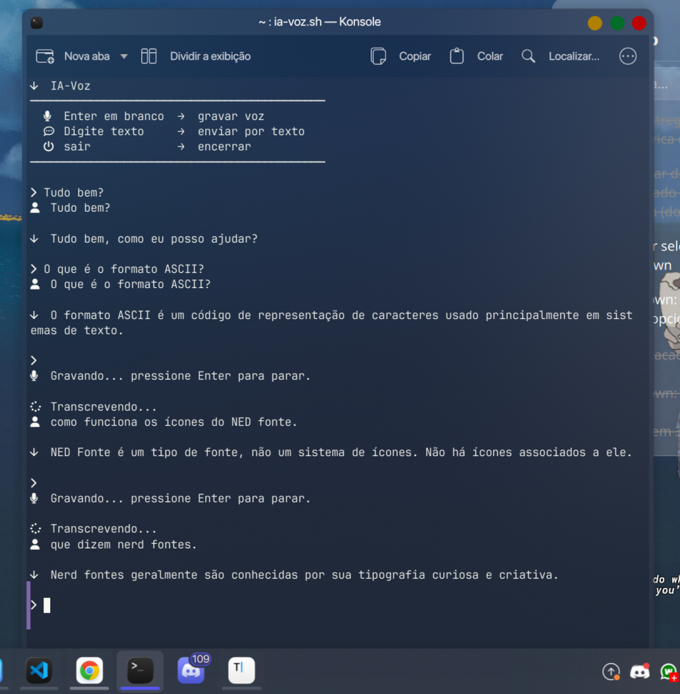

# 🤖 IA-Voz

Assistente de IA local com voz, rodando 100% offline no Linux.



Fala com a IA pelo microfone ou pelo teclado — ela responde em texto e em voz alta.

```
Você (voz ou texto) → Whisper (transcrição) → LLaMA (resposta) → Kokoro (fala)
```

---

## Dependências

### Sistema (Fedora/RHEL)
```bash
sudo dnf install portaudio-devel python3-devel
```

### Modelos LLM (GGUF)
Baixe os modelos e coloque na home (`~/`):
- [Qwen 3B](https://huggingface.co/Qwen) → `~/qwen3b.gguf`
- [Qwen 7B Coder](https://huggingface.co/Qwen) → `~/qwen7b.gguf`

### llama.cpp
```bash
git clone https://github.com/ggerganov/llama.cpp
cd llama.cpp
cmake -B build && cmake --build build --config Release
```

### Kokoro TTS + Whisper STT
```bash
git clone https://github.com/seu-usuario/ia-voz
cd ia-voz/kokoro-tts

# Instala uv (se não tiver)
curl -LsSf https://astral.sh/uv/install.sh | sh

# Cria ambiente com Python 3.11 e instala dependências
uv python pin 3.11
uv sync
```

---

## Estrutura

```
ia-voz/
├── ia-voz.sh           # script principal
└── kokoro-tts/
    ├── kokoro_server.py # servidor TTS (texto → voz)
    ├── whisper_server.py# servidor STT (voz → texto)
    └── pyproject.toml
```

---

## Como usar

```bash
chmod +x ia-voz.sh
./ia-voz.sh
```

No menu inicial, escolha o modelo. Após carregar:

| Ação | Resultado |
|------|-----------|
| `Enter` em branco | Inicia gravação de voz 🔴 |
| `Enter` de novo | Para gravação e transcreve |
| Digitar texto + `Enter` | Envia por texto |
| `sair` | Encerra o programa |

---

## Funcionamento interno

O script inicia três processos em paralelo comunicando via **named pipes (FIFO)**:

- **`kokoro_server.py`** — recebe texto pelo stdin, fala em voz alta via PyAudio
- **`whisper_server.py`** — recebe comando `gravar` pelo stdin, grava o microfone, transcreve com Whisper e retorna o texto
- **`llama-completion`** — chamado a cada pergunta com o modelo GGUF escolhido

---

## Requisitos

- Linux (testado no Fedora 43 com KDE Plasma 6)
- Python 3.11
- [uv](https://github.com/astral-sh/uv)
- JetBrainsMono Nerd Font (para os ícones no terminal)
- Microfone funcional